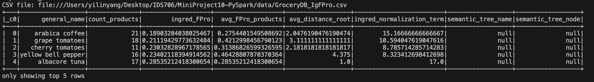
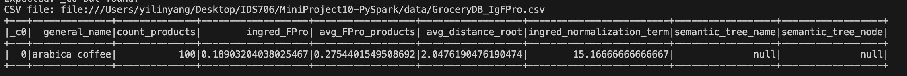
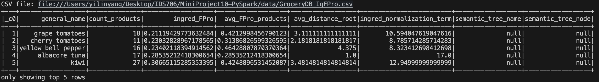

# IDS706 Mini Project10: GroceryDB CRUD Application

## Project Description

This project is a simple Python application that interacts with a SQLite database named `GroceryDB`. It provides basic CRUD functionality: Create, Read, Update, and Delete operations on the `GroceryDB` database. It is adpated from mini project5 while using Spark SQL.

## Queries Description & Results

### Query 1 - Read Operation
- This query performs read operation on the `GroceryDB` database. It selects all the rows from the `GroceryDB` table and displays the top 5 rows of the table.
```python
df.show(5)
```
### Result


### Query 2 - Update Operation
```python
df_updated = df.withColumn("count_products", 
                           when(df["general_name"] == "arabica coffee", 100)
                           .otherwise(df["count_products"]))
```
### Result


### Query 3 - Delete Operation
```python
df_updated = df_updated.filter(df_updated["general_name"] != "arabica coffee")
```
### Result


## How to Run
```bash
python3 spark.py
```
## Thoughts about Spark SQL